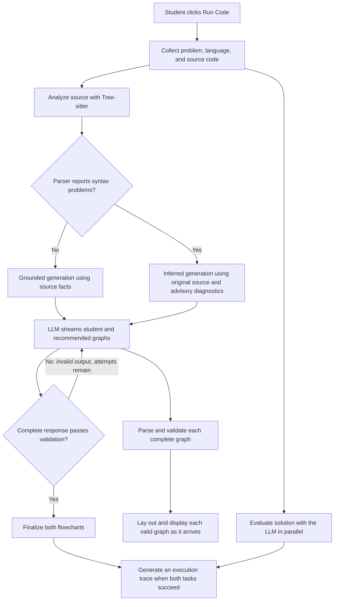

# Flowchart generation workflow

CodeFlow turns a student's Java or Python solution into two comparable flowcharts: the student's logic and a recommended solution. The workflow combines source parsing, LLM generation, local validation, and automatic diagram layout.

## Overview

The diagram shows the main path. Transport failures and exhausted generation attempts produce an error; valid graph previews from the current attempt can remain visible.

## 1. Start a run

**Input:** The structured practice problem (title, description, examples, and constraints), the student's exact Java or Python source, and the selected model configuration.

Clicking **Run Code** captures these inputs for the run and starts two independent tasks: solution evaluation and flowchart generation. Evaluation asks the model for a correctness verdict and test results; flowchart generation begins with source analysis. Model credentials travel in a separate request field, outside the prompt text.

**Output:** Two pending tasks with separate progress and result states. The Code Analysis panel opens immediately, and either task can publish its result without waiting for the other. Cancellation prevents late responses from replacing results from a newer run.

## 2. Analyze the source and choose a generation mode

**Input:** The selected language and original source code, sent to `/api/analyze-code`.

The backend uses the language's Tree-sitter grammar to build a syntax tree. It then walks that tree and extracts a compact list of facts: conditions, operations, exits, their nesting and branch relationships, and their source locations. Each fact receives an identifier such as `c1` or `p1`, called a source anchor. This analysis does not execute the code.

The backend also calculates `flowchartRequired` for each fact. Its simple rule excludes a statement when an earlier direct sibling in the same sequential block is an unconditional exit, such as `return`, `throw`, `break`, or `continue`. Other facts remain required. This field is computed by application code, not by the LLM, and is not a complete proof of reachability.

When syntax is malformed, Tree-sitter can still return a partial structure containing missing-token markers or `ERROR` regions. These markers let parsing continue without changing the source text. The backend collects them as `syntaxIssues`; the recovered structure may not reflect the student's intended nesting.

**Output:** A structured analysis object containing `facts`, function information, source locations, `syntaxIssues`, and a `parseStatus` of `clean` or `recovered`. The frontend uses this result to select the next generation mode:

The parser result determines how the model is prompted:

| Mode | When selected | How the model uses the source |
| --- | --- | --- |
| Grounded | The parser reports a clean parse with no syntax issues | Receives the original code plus parser facts. Student graph nodes must account for required facts through source anchors. |
| Inferred | The parser reports recovered syntax or syntax issues | Receives the original code plus advisory diagnostics, without parser facts or anchor constraints. It makes a cautious interpretation of the visible source. |

A clean parse does not establish that the program compiles or is logically correct. A parser request failure is reported as an error rather than selecting inferred mode.

## 3. Generate both graphs in one model response

**Input:** The problem, language, and original source, together with the selected system prompt. Grounded mode includes the source-analysis facts; inferred mode includes only advisory syntax diagnostics from that analysis, leaving out the recovered structural facts.

The frontend sends this input to `/api/resource/stream`. The backend validates the research password or supplied model configuration, constructs the selected provider model through AgentScope, and forwards the system prompt and user message to it.

The prompt asks for two graphs:

- **Student graph:** preserve the student's conditions, operations, branches, loops, and return values, including their logic mistakes.
- **Recommended graph:** solve the problem correctly while retaining the student's approach and using matching steps where possible.

Logic feedback comes from comparing the two structures. Explicit annotations inside student nodes identify syntax tokens. In inferred mode, the same response can also include suspected missing punctuation, displayed separately above the diagrams.

**Output:** A streamed JSON object with `student` and `llm` graphs. Each graph contains nodes with IDs, kinds (such as condition or process), and display labels, plus edges specifying their connections and branch labels. Grounded student nodes also reference facts through `sourceAnchors`; inferred output can include a separate `missingSymbols` list.

For example, a condition node might reference `c1` to declare that it represents the corresponding source condition. The prompt asks for labels copied or closely paraphrased from the source. The model supplies graph content and connections; screen positions and visual routing are calculated later. The normal flowchart path uses one model request for both graphs, with no separate model reviewer.

## 4. Stream, validate, and publish progress

**Input:** The model's response text arriving in chunks, together with the expected graph contract and, in grounded mode, the source facts.

The backend wraps text chunks in newline-delimited JSON events, including text deltas and an explicit completion event. The frontend decodes these events and scans the accumulating model JSON while respecting strings, escapes, and nested objects. It processes a graph only when that graph's entire object has arrived; it does not guess how unfinished JSON should end.

Each completed graph is checked before display. Validation covers node IDs and kinds, existing edge endpoints, start and exit rules, labelled branches, and whether nodes are reachable from START. Grounded student graphs also undergo source-anchor checks: required facts must be covered exactly once, references must exist, node kinds must match their facts, and only process nodes can combine consecutive facts.

Anchor validation checks the declared mapping, not the equivalence of the displayed text to the source. It does not compare labels word for word or verify connections against the source's nesting and branch relationships. Preserving those details remains a model instruction. Missing-symbol suggestions are separately checked against the original source; unmatched or ambiguous references are shown without an asserted location.

**Output:** Validated graph objects published as progress, followed by a successful complete pair or an error state. This allows the student graph to appear while the recommended graph is still generating. The full operation succeeds only after the stream explicitly completes and the entire response passes validation.

If output is malformed or violates the graph contract, the frontend sends the validation problems back in another generation attempt, up to three attempts total. A new attempt clears the previous graph previews. Connection failures do not automatically start another generation.

These checks establish structural consistency; they do not prove that the model's interpretation or recommended algorithm is correct.

## 5. Arrange and display the flowcharts

**Input:** A validated graph's nodes, labels, syntax annotations, and edges. Each graph can enter this stage independently as it becomes available.

The frontend converts the graph into React Flow's rendering format and mounts the node boxes so their actual sizes and connection points can be measured. **ELK Layered** uses these measurements and the graph connections to calculate node positions and line routes, including bends around branches and loops. Layout changes presentation, not the model-generated graph connections or code labels. If ELK fails or times out, the application uses the **Dagre** fallback layout and displays a notice.

**Output:** Interactive student and recommended flowcharts displayed side by side, with syntax marks rendered on the relevant student labels. Students can drag nodes and use **Re-Layout** to arrange them again. Receiving the other graph or completing the stream preserves the already displayed graph's manual positions.

## 6. Follow with an execution trace

**Input:** The completed graph pair, original problem and source, and a test input selected from the evaluation results. The application prefers a failing case, chooses the shortest input among the preferred cases, and excludes cases reported as compile errors. If no case is traceable, it displays a reason and skips tracing.

Once both earlier tasks succeed, a separate model request asks for a sequence of steps through the existing graph nodes for each side. It receives the chosen input and expected result when available. The evaluation's reported student output is kept out of the prompt so it can serve as a separate comparison afterward.

The frontend checks that trace steps reference existing nodes and follow graph edges, and bounds the trace length. It also compares the completed student trace's output with the evaluation's reported output and shows a warning if they disagree.

**Output:** A trace for each graph containing visited node IDs, variable values, step notes, and a final output or truncation status. The trace appears below the comparison on another copy of the same graphs, with step controls. Students can also supply another input for a new trace.

Tracing is a follow-up to flowchart generation and does not regenerate the graphs. Both evaluation and tracing are model-generated; this workflow does not run the student's program in a compiler or interpreter.

## Main implementation locations

| Responsibility | Main files |
| --- | --- |
| Start and coordinate the run | `frontend/src/MainContent.tsx`, `frontend/src/lib/analysisRun.ts` |
| Orchestrate flowchart generation and choose its mode | `frontend/src/lib/flowchartClient.ts`, `frontend/src/lib/flowchartGeneration.ts` |
| Extract source facts | `backend/code_analysis.py`, exposed through `backend/app.py` |
| Define the model's instructions | `frontend/src/config/systemPrompt_GenerateFlowchart.ts` |
| Select the provider and stream model output | `backend/model_config.py`, `backend/model_stream.py` |
| Decode streaming JSON and validate graphs | `frontend/src/lib/llmStreamClient.ts`, `frontend/src/lib/jsonObjectStream.ts`, `frontend/src/lib/llmSchemas.ts` |
| Display and arrange graphs | `frontend/src/RightContent.tsx`, `frontend/src/FlowchartDiagram.tsx`, `frontend/src/lib/elkFlowchartLayout.ts` |
| Generate the follow-up trace | `frontend/src/lib/traceRun.ts`, `frontend/src/lib/traceClient.ts` |
