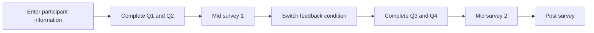
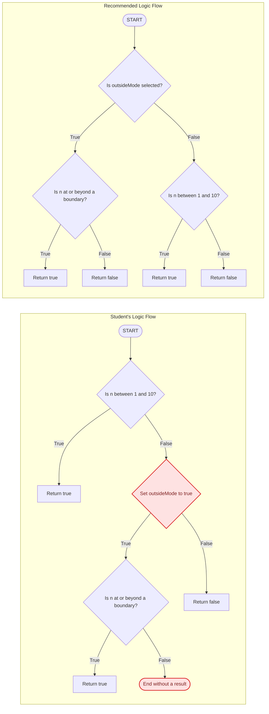

# CodeFlow: Brief System Overview

## What is CodeFlow?

CodeFlow is a web-based learning tool and human-study platform for students in introductory programming courses. It compares two independent AI-generated debugging feedback approaches: visual flowchart feedback and textual step-by-step feedback.

Instead of giving students corrected code immediately, both conditions encourage them to examine their own approach and revise it themselves. The study contains four fixed C++ exercises: a solution-writing task and a debugging task in each stage.

Participants are assigned to a group before opening the platform. Group A uses CodeFlow for Q1–Q2 and textual feedback for Q3–Q4. Group B uses textual feedback for Q1–Q2 and CodeFlow for Q3–Q4. This keeps the question order fixed while counterbalancing feedback order and ensures that both question sets are evaluated under both conditions.

## The student experience

A student enters their name, contact email, and preassigned group, then works through the four questions in order. The browser saves each question independently, including its code and generated feedback, so switching questions or refreshing the page does not replace earlier work. Participant information remains editable, and earlier questions remain accessible.

In the CodeFlow condition, selecting **Run Code** provides three connected views:

1. **Results:** The student sees whether the solution produces the expected results for several example inputs.
2. **Visual comparison:** CodeFlow places a visual map of the student's approach beside a recommended approach. This helps the student notice where the two approaches make different decisions.
3. **Step-by-step view:** The student can follow one example through both visual maps and see where their paths first separate.

In the textual condition, the model analyzes the problem and submission independently, without receiving flowchart or trace data. It presents comparable feedback scope without diagrams or a chat interface: one input, a neutral overview of the submitted logic, its step-by-step execution with state, a neutral overview of a recommended approach, and that approach's execution on the same input. It does not provide corrected code, explain why one approach is preferable, or explicitly identify the bug.

## Example of the visual comparison

The example below asks the student to decide whether a number is inside the range 1–10. When `outsideMode` is selected, the rule is reversed and numbers at or beyond the two boundaries should be accepted instead.

CodeFlow turns the student's submitted logic and the recommended logic into two comparable flows:

In the student's flow, the range is checked before the program considers `outsideMode`. The submission also changes the value of `outsideMode` instead of asking whether it is selected, and one path ends without producing a result. The recommended flow makes the intended choice first and produces a result on every path.

This side-by-side view lets the student see both the order of decisions and the location of the problem without being given replacement code. In this particular example, the submitted Java program cannot produce a complete run, so CodeFlow shows a short explanation instead of creating a misleading execution trace.

The student can then return to the editor, revise the solution, and try again. If CodeFlow cannot create a complete step-by-step view for a submission, it gives the student a short message and they can continue revising their work.

An example problem is built into the interface, so study participants can begin using the system without preparing their own exercise.

## Educational purpose

CodeFlow is intended to support debugging, reflection, and learning from mistakes. Its main goal is to help students see the relationship between the code they wrote and the behavior of that code, while leaving the problem-solving work to the student.
