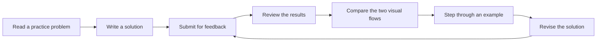

# CodeFlow: Brief System Overview

## What is CodeFlow?

CodeFlow is a web-based learning tool for students in introductory programming courses. It helps students understand how their solution works by turning program logic into visual, step-by-step feedback.

Instead of giving students a corrected answer immediately, CodeFlow encourages them to examine their own approach, find where it differs from a recommended approach, and revise the solution themselves. The current system supports introductory Java, Python, and C++ exercises.

## The student experience

A student begins with a programming problem and writes a solution in the CodeFlow editor. After selecting **Run Code**, the student receives three connected views of the solution:

1. **Results:** The student sees whether the solution produces the expected results for several example inputs.
2. **Visual comparison:** CodeFlow places a visual map of the student's approach beside a recommended approach. This helps the student notice where the two approaches make different decisions.
3. **Step-by-step view:** The student can follow one example through both visual maps and see where their paths first separate.

## Example of the visual comparison

The example below asks the student to decide whether a number is inside the range 1–10. When `outsideMode` is selected, the rule is reversed and numbers at or beyond the two boundaries should be accepted instead.

CodeFlow turns the student's submitted logic and the recommended logic into two comparable flows:

In the student's flow, the range is checked before the program considers `outsideMode`. The submission also changes the value of `outsideMode` instead of asking whether it is selected, and one path ends without producing a result. The recommended flow makes the intended choice first and produces a result on every path.

This side-by-side view lets the student see both the order of decisions and the location of the problem without being given replacement code. In this particular example, the submitted Java program cannot produce a complete run, so CodeFlow shows a short explanation instead of creating a misleading execution trace.

The student can then return to the editor, revise the solution, and try again. If CodeFlow cannot create a complete step-by-step view for a submission, it gives the student a short message and they can continue revising their work.

An example problem is built into the interface, so study participants can begin using the system without preparing their own exercise.

## Educational purpose

CodeFlow is intended to support debugging, reflection, and learning from mistakes. Its main goal is to help students see the relationship between the code they wrote and the behavior of that code, while leaving the problem-solving work to the student.
